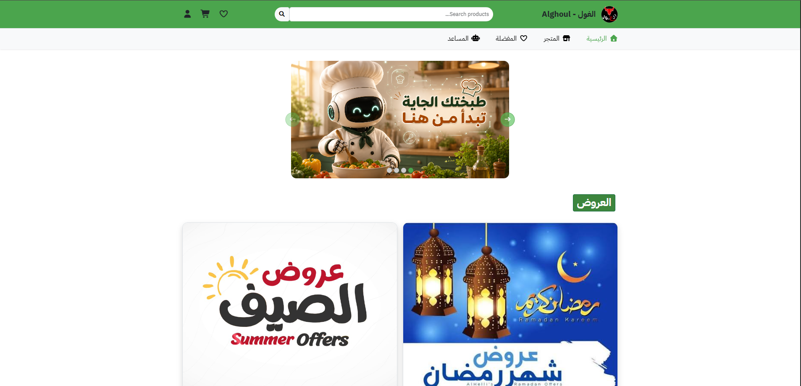
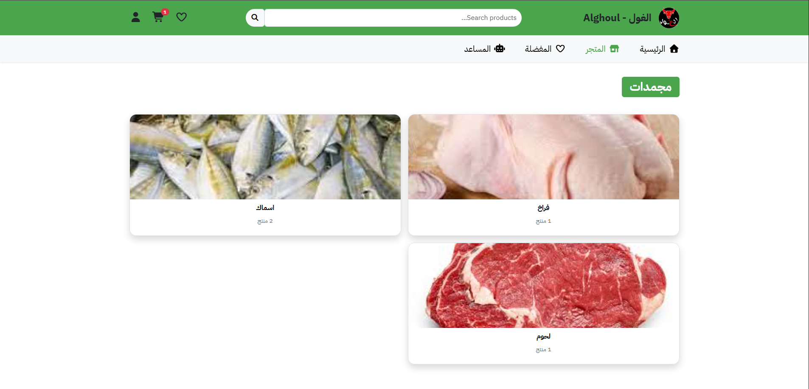
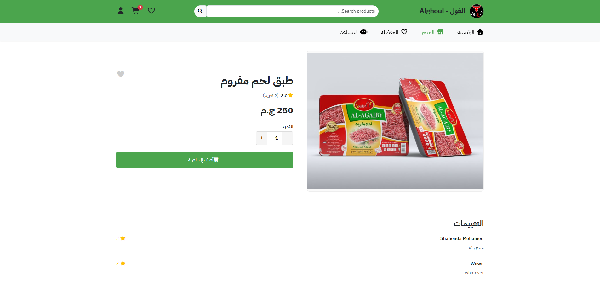
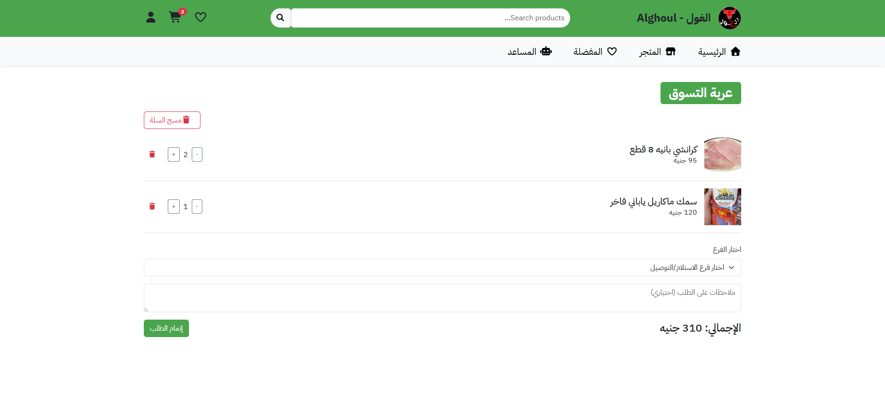
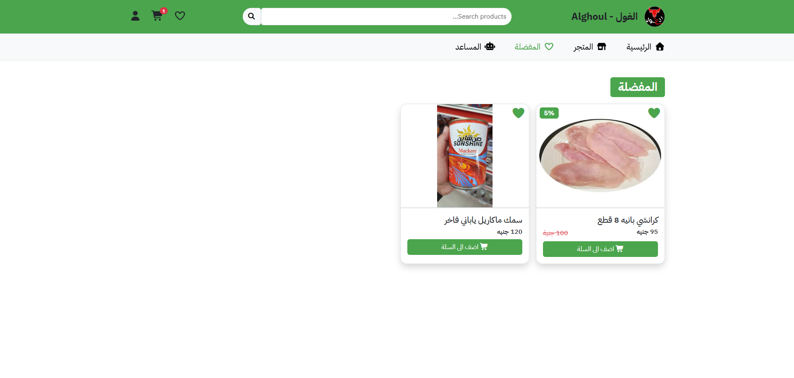
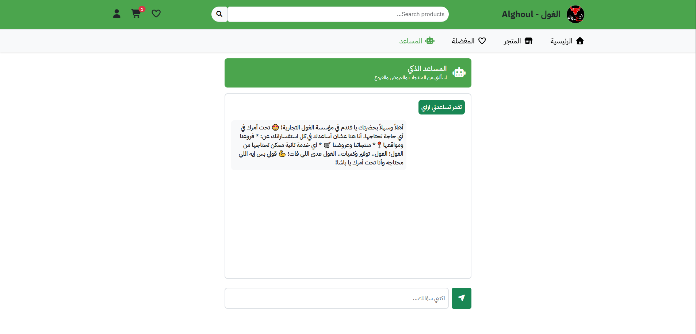
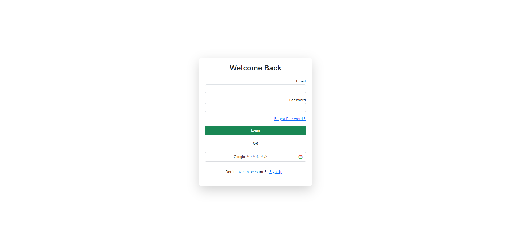

# 🛍️ Online Shop – Frontend

A modern and responsive **E-commerce web application** built with **React.js and Vite**.

🔗 **Live Demo:** [Visit the Website](https://icy-bush-014113d10.7.azurestaticapps.net/)

The application provides a complete online shopping experience where users can browse products, search and filter items, manage their cart and wishlist, place orders, review products, and interact with an AI-powered chatbot.

---

## 📌 Overview

**Online Shop** is a frontend e-commerce application designed to provide users with a smooth and interactive shopping experience.

The project is built using a component-based architecture with reusable React components, centralized state management using the **Context API**, and API communication using **Axios**.

The application also integrates:

* User authentication
* Google authentication
* Product browsing and categorization
* Shopping cart management
* Wishlist management
* Orders and order details
* Product reviews
* Search functionality
* Offers and checkout
* AI-powered chatbot using Google Gemini

---

## ✨ Features

### 🏠 Home

* Featured products
* Discounted products
* Special offers
* Product categories
* Navigation to different sections of the store

### 🛍️ Products & Shopping

* Browse all available products
* Browse products by category
* View product details
* Search for products
* Product filtering
* Product quantity management
* Add products to cart
* Add products to wishlist

### 🛒 Shopping Cart

Users can:

* Add products to the cart
* Remove products
* Increase/decrease product quantities
* View cart items
* Calculate the total price
* Proceed to checkout

Cart state is managed globally using **React Context API**.

### ❤️ Wishlist

Users can:

* Add products to their wishlist
* Remove products from the wishlist
* View saved products
* Move between wishlist and product pages

Wishlist state is managed using a dedicated `WishlistContext`.

### 👤 Authentication

The application supports:

* User registration
* Login
* Logout
* Forgot password
* Reset password
* Verification code
* Google authentication
* Completing Google user profile

Authentication state is handled globally using `AuthContext`.

### 📦 Orders

Authenticated users can:

* View their orders
* View individual order details
* Track their previous purchases

### ⭐ Reviews

Users can interact with product reviews through the dedicated reviews section.

### 🤖 AI Chatbot

The project includes an AI-powered chatbot integrated with **Google Gemini**.

The chatbot is designed to provide users with an interactive assistant while shopping.

The Gemini API key is configured through an environment variable:

```env
VITE_GEMINI_API_KEY=YOUR_API_KEY_HERE
```

The repository includes a `.env.example` file for configuration.

### 🔎 Search

Users can search for products through the search interface and view the results in a dedicated search results page.

### 🎁 Offers

The application supports product offers and provides a dedicated checkout flow for offers.

---

## 📸 Screenshots

### 🏠 Home



### 🛍️ Shop



### 📦 Product Details



### 🛒 Shopping Cart



### ❤️ Wishlist



### 🤖 AI Chatbot



### 🔐 Authentication



## 🛠️ Technologies Used

| Technology            | Purpose                                |
| --------------------- | -------------------------------------- |
| **React.js**          | Building the user interface            |
| **Vite**              | Development environment and build tool |
| **React Router DOM**  | Client-side routing                    |
| **Context API**       | Global state management                |
| **Axios**             | API communication                      |
| **Bootstrap**         | Responsive UI and styling              |
| **Font Awesome**      | Icons                                  |
| **React Toastify**    | Notifications                          |
| **Google OAuth**      | Google authentication                  |
| **Google Gemini**     | AI chatbot                             |
| **JavaScript (ES6+)** | Application logic                      |

The current `package.json` confirms the project uses React, Vite, React Router, Axios, Bootstrap, Font Awesome, Google OAuth, Google GenAI, and React Toastify.

---

## 🧩 Project Architecture

The project follows a modular React structure:

```text
src/
│
├── assets/
│   └── Images and static assets
│
├── components/
│   ├── DesktopNavbar.jsx
│   ├── Header.jsx
│   ├── Layout.jsx
│   ├── Navbar.jsx
│   ├── OfferCard.jsx
│   ├── ProductCard.jsx
│   └── SaleProductCard.jsx
│
├── context/
│   ├── AuthContext.jsx
│   ├── CartContext.jsx
│   └── WishlistContext.jsx
│
├── data/
│   └── Application data
│
├── pages/
│   ├── Home.jsx
│   ├── Shop.jsx
│   ├── Cart.jsx
│   ├── Wishlist.jsx
│   ├── Profile.jsx
│   ├── Chatbot.jsx
│   ├── SearchResults.jsx
│   ├── OfferCheckout.jsx
│   │
│   ├── products/
│   │   ├── Products.jsx
│   │   ├── ProductDetails.jsx
│   │   └── SubCategories.jsx
│   │
│   ├── orders/
│   │   ├── Orders.jsx
│   │   └── OrderDetails.jsx
│   │
│   ├── reviews/
│   │   └── Reviews.jsx
│   │
│   └── signIn/
│       ├── Register.jsx
│       ├── ForgetPassword.jsx
│       ├── ResetPassword.jsx
│       ├── verifyCode.jsx
│       └── CompleteGoogleProfile.jsx
│
├── services/
│   ├── Api.js
│   ├── axiosInstance.js
│   ├── googleCongif.js
│   ├── googleGemini.js
│   └── validation.js
│
├── App.jsx
└── main.jsx
```

The repository currently separates reusable components, pages, contexts, data, and service/API logic into dedicated folders.

---

## 🔄 State Management

The application uses **React Context API** to manage global application state.

### AuthContext

Responsible for managing authentication-related state and user information.

```text
AuthContext
    │
    ├── Login
    ├── Logout
    ├── Register
    └── Authentication State
```

### CartContext

Responsible for managing shopping cart data.

```text
CartContext
    │
    ├── Add to Cart
    ├── Remove from Cart
    ├── Update Quantity
    └── Cart Total
```

### WishlistContext

Responsible for managing wishlist products.

```text
WishlistContext
    │
    ├── Add to Wishlist
    ├── Remove from Wishlist
    └── Wishlist State
```

These contexts are provided globally from `App.jsx`, allowing different pages and components to access shared state without prop drilling.

---

## 🧭 Routing

The application uses **React Router DOM** for client-side navigation.

Main routes include:

```text
/
├── /shop
├── /product/:id
├── /wishlist
├── /chatbot
├── /cart
├── /profile
├── /orders
├── /orders/:id
├── /reviews
├── /search
├── /SubCategories/:categoryId
├── /Products/:categoryId
├── /offer/:offerId/checkout
│
├── /Login
├── /Register
├── /ForgetPassword
├── /ResetPassword
├── /verifyCode
└── /CompleteGoogleProfile
```

The routing structure is defined in `App.jsx` and uses a shared `Layout` for the main store pages.

---

## 🌐 API Integration

The frontend communicates with the backend through HTTP requests.

Axios is used as the main API communication library.

The project includes a centralized Axios instance:

```text
src/services/axiosInstance.js
```

This helps centralize API configuration and request handling.

API-related logic is organized under:

```text
src/services/
├── Api.js
├── axiosInstance.js
├── googleCongif.js
├── googleGemini.js
└── validation.js
```

This separation keeps API and external-service logic independent from the UI components.

---

## 🤖 Gemini AI Integration

The project integrates Google's Gemini API to provide an AI-powered shopping chatbot.

The Gemini configuration is handled separately inside:

```text
src/services/googleGemini.js
```

The API key should be stored in an environment variable instead of being hard-coded.

Create a `.env` file in the project root:

```env
VITE_GEMINI_API_KEY=YOUR_API_KEY_HERE
```

> ⚠️ Never commit your actual API key to GitHub.

The repository provides `.env.example` as a template.

---

## 🚀 Getting Started

### 1. Clone the repository

```bash
git clone https://github.com/shahendamohamed22/Online-shop-Frontend.git
```

### 2. Navigate to the project

```bash
cd Online-shop-Frontend
```

### 3. Install dependencies

```bash
npm install
```

### 4. Configure environment variables

Create a `.env` file:

```env
VITE_GEMINI_API_KEY=YOUR_API_KEY_HERE
```

### 5. Start the development server

```bash
npm run dev
```

The application will be available through the local URL displayed by Vite.

---

## 📜 Available Scripts

### Development

```bash
npm run dev
```

Starts the Vite development server.

### Production Build

```bash
npm run build
```

Creates an optimized production build.

### Preview

```bash
npm run preview
```

Runs the production build locally for preview.

### Lint

```bash
npm run lint
```

Runs Oxlint to check the project code.

These scripts are defined in the project's `package.json`.

---

## 📱 Responsive Design

The application is designed to provide a responsive shopping experience across different screen sizes.

Bootstrap is used alongside custom styling to help build responsive layouts and reusable UI elements.

---

## 🔐 Authentication Flow

The authentication system supports both traditional and Google-based authentication.

### Traditional Authentication

```text
Register
   ↓
Login
   ↓
Authentication State
   ↓
Access User Features
```

### Password Recovery

```text
Forgot Password
       ↓
Verification
       ↓
Reset Password
       ↓
Login
```

### Google Authentication

```text
Google Login
     ↓
Google Authentication
     ↓
Complete Profile (if required)
     ↓
Authenticated User
```

The authentication-related pages are separated under `pages/signIn`, while authentication state is handled through `AuthContext`.

---

## 🛒 Shopping Flow

A typical shopping journey looks like:

```text
Home
  ↓
Shop
  ↓
Browse Categories
  ↓
View Products
  ↓
Product Details
  ↓
Add to Cart
  ↓
Cart
  ↓
Checkout
  ↓
Order
```

Users can also save products to their wishlist and return to them later.

---

## 📂 Main Application Sections

### Components

Reusable UI components such as:

* Navigation bars
* Product cards
* Offer cards
* Sale product cards
* Layout components

are stored in:

```text
src/components
```

### Pages

Application screens and routes are stored in:

```text
src/pages
```

### Context

Global state management is handled in:

```text
src/context
```

### Services

API communication, Google services, Gemini integration, and validation utilities are stored in:

```text
src/services
```

---

## 🧪 Development Notes

When adding a new feature:

1. Create the required page/component.
2. Keep reusable UI inside `components`.
3. Keep page-level logic inside `pages`.
4. Use Context when state needs to be shared across multiple components.
5. Keep API-related logic inside `services`.
6. Use environment variables for API keys and other secrets.
7. Follow the existing project structure to keep the codebase maintainable.

---

## 📌 Future Improvements

Possible future enhancements include:

* Advanced product filtering and sorting
* Improved error handling
* Loading skeletons
* Pagination optimization
* Better accessibility
* Unit and integration testing
* Performance optimization
* Improved chatbot capabilities
* Enhanced checkout and payment integration

---

## 👩‍💻 Author

**Shahenda Mohamed**

Frontend Developer

* GitHub: [@shahendamohamed22](https://github.com/shahendamohamed22)

---

## 📄 License

This project is intended for educational and portfolio purposes.
